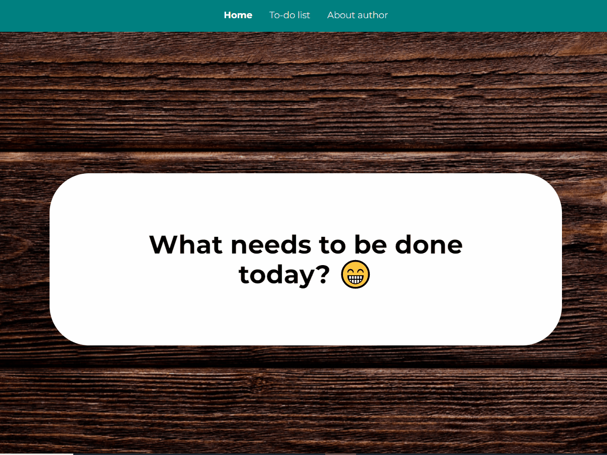

# To-Do List

## Table of content
- [Demo](#Demo)
- [General info](#general-info)
- [How it works?](#how-it-works)
- [Technologies/Conventions I used](#TechnologiesConventions-I-used)
- [Available Scripts](#available-scripts)

## Demo
https://eltair41.github.io/todos-list-react/

## General info
Project is a simple example of to do list. It allows to create list of tasks and manipulated it freely. Project is easy and fun to use.
## How it works?
1. Welcome on To Do List 😁. 
To use the list of tasks, click Task list on the navigation bar, or if you are interested in the author, click About author.

2. Enter any task in a text field and then press the add task button.
As you can see the new task has been added to the list and the focus is automatically set in text field. You can also add exaple tasks, for this you need to press the "Download example tasks" button and wait a few seconds. The tasks will be downloaded and automatically placed on the task list.

    Warning - (remember that, downloaded tasks will replace the current task list and cancel all interactions related to it)

3. Now you can add another task or if the current task has been completed, press green button. Completed task will be crossed out. Of course you can reverse the process by pressing the green button again.

4. A completed task can also be completly removed from the list. To do this, press the red button with a wastebasket icon.

5. You can use two special buttons as well. The first one turns on when at least one of the tasks has been completed, then the button can be used to hide or show completed tasks.
The second, when clicked, sets all tasks as completed, then it is turned off until there is one incomplete task.

6. Use the search engine to filter your tasks. If necessary, just enter the beginning of the search phrase.

7. If you interested in details of any of the tasks, just click on the task you are interested in and you will be taken to the task details subpage.

8. An example of project's operation has been presented on the GIF.

## Technologies/Conventions I used
Project is created with:
-  project was bootstrapped with [Create React App](https://github.com/facebook/create-react-app).
- React hooks
- React-redux
- Redux-Saga
- reduxjs/toolkit
- React-Router
- axios
- Custom hooks
- styledComponents
## Available Scripts

In the project directory, you can run:

### `npm start`

Runs the app in the development mode.\
Open [http://localhost:3000](http://localhost:3000) to view it in your browser.

The page will reload when you make changes.\
You may also see any lint errors in the console.

### `npm run build`

Builds the app for production to the `build` folder.\
It correctly bundles React in production mode and optimizes the build for the best performance.

The build is minified and the filenames include the hashes.\
Your app is ready to be deployed!

See the section about [deployment](https://facebook.github.io/create-react-app/docs/deployment) for more information.

### `npm run eject`

**Note: this is a one-way operation. Once you `eject`, you can't go back!**

If you aren't satisfied with the build tool and configuration choices, you can `eject` at any time. This command will remove the single build dependency from your project.

Instead, it will copy all the configuration files and the transitive dependencies (webpack, Babel, ESLint, etc) right into your project so you have full control over them. All of the commands except `eject` will still work, but they will point to the copied scripts so you can tweak them. At this point you're on your own.

You don't have to ever use `eject`. The curated feature set is suitable for small and middle deployments, and you shouldn't feel obligated to use this feature. However we understand that this tool wouldn't be useful if you couldn't customize it when you are ready for it.
